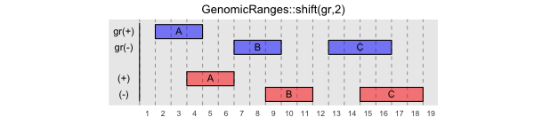
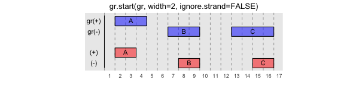
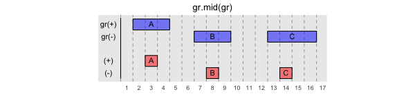
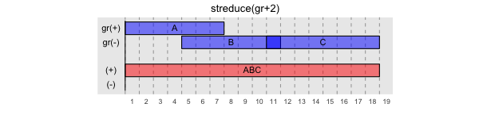

Range Operations
----------------

This section will describe additional GRanges operations provided by gUtils.

.. code-block:: bash

   ## make some example data sets
   ref19 <- readRDS(system.file("extdata","refGene.hg19.gr.rds", package="gUtils"))
   gr  <- GRanges(1, IRanges(c(2,5,10), c(4,9,16)), seqinfo=Seqinfo("1", 20))
   gr2 <- c(gr, GRanges(1, IRanges(c(1,9), c(6,14)), seqinfo=Seqinfo("1", 20)))
   dt <- data.table(seqnames=1, start=c(2,5,10), end=c(3,8,15))

.. figure:: figures/flank.png
   :alt:
   :scale: 125 %

.. figure:: figures/gr.start.png
   :alt:
   :scale: 125 %

.. figure:: figures/gr.end.png
   :alt:
   :scale: 125 %

